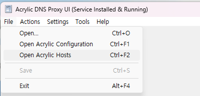
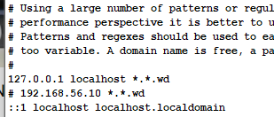
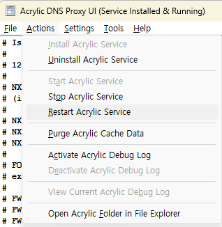
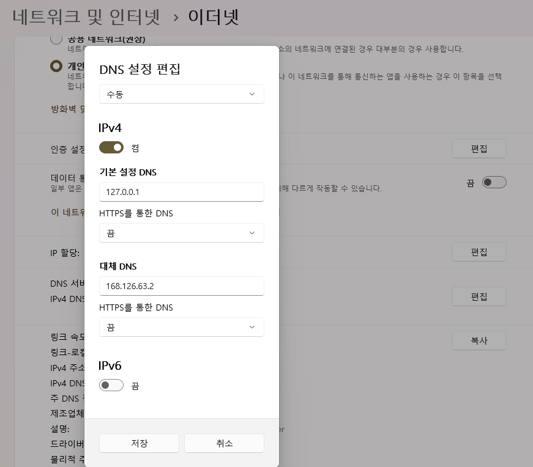
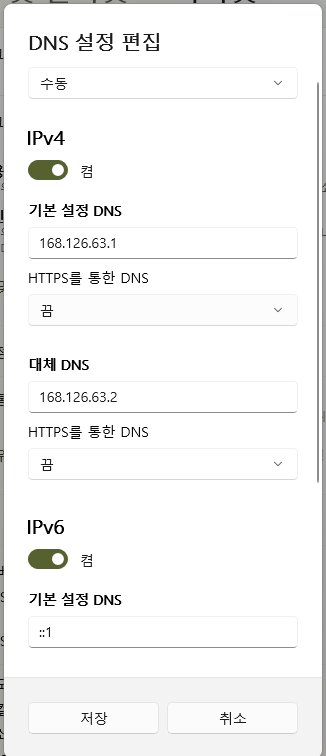

개발환경 구성
============

개발 업무
--------

개발 업무에서 필요한 요소는 아래와 같다.

* PHP 버전 5.6, 7.x, 8.x 등 3개 버전을 모두 이용한다.
* 단순한 사이트에서부터 도매인 기반 특수 사이트 개발을 해야 한다.
* Laravel 기반 프로젝트 수행 시 문제가 없어야 한다.
* Apache Solr를 이용한 검색 기능을 하는 사이트 유지보수를 해야한다.

필요한 도구
-------------------

위 업무를 위해 도커와 몇가지 도구를 이용하여 개발환경을 구성한다.

* PHP 버전별 도커 컨테이너, 데이터베이스 컨테이너, Apache Solr 컨테이너
* 내부 도매인 주소 공유를 위한 도구 (DNsmasq, Acrylic Dns proxy)

## PHP 버전별 도커 컨테이너

PHP 버전별 컨테이느는 아래와 같이 3개로 구성하고 각각에 태그를 붙여 도커허브에 저장한다.

* pig482/devenv:p56 : PHP 5.6용 컨테이너
* pig482/devenv:p74 : PHP 7.4용 컨테이너
* pig482/devenv:p82 : PHP 8.2용 컨테이너

## 데이터베이스 도커 컨테이너

프로젝트 중 시간권 문제에 민감한 것이 있어 기존 MySQL 공식 도커 이미지의 도커 Dockerfile을 수정하여 이용한다.

* pig482/mysql:kr : 시간권을 서울로 지정한 MySQL 데이터베이스

## 검색엔진 도커 컨테이너

중유 유지보수 사이트의 경우 검색인진 기능이 탑제되어 있고, 검색엔진 기능은 Apache Solr를 이용한다. 이에 해당 도커 컨테이너를 생성한다.

* pig482/solr:55 : Apache Solr 5.5.5 도커 컨테이너


컨테이너 빌더 리소스 구성
-----------------------

## PHP 도커 칸테이너 빌드 구성 파일

각 버전에 따라 약간 내용이 다를 수 있으나 대부분 아래와 같이 파일을 구성한다.

* myadmin : PhpMyAdmin 프로그램 폴더
* ssl_key : 셀스서명한 키파일 폴더
* Dockerfile : 도커 이미지 빌드용 파일
* docker_entrypoint.sh : 컨테이너 실행 시 실행될 스크립트
* drush : Drupal 7.x 사이트 관리 도구
* index.php : 컨테이너에서 관리 중인 사이트 도우미 프로그램
* confs : Apache site 환경설정 파일
* svhost.sh : 멀티 호스트 도매인 사이트, 일반적인 사이트 운영 모드 변경옹 스크립트

자세한 내용은 각 버전의 소스를 확인한다.

* [PHP 5.6](https://github.com/j-hansol/Dev-Environment/tree/master/dev_env56)
* [PHP 7.4](https://github.com/j-hansol/Dev-Environment/tree/master/dev_env74)
* [PHP 8.2](https://github.com/j-hansol/Dev-Environment/tree/master/dev_env82)

## MySQL 도커 컨테이너 빌드 구성 파일

MySQL 의 경우 나의 업무 중 시간권과 관련하여 민감한 부분이 있어 부득이하게 시간권을 설정해야 했다. 그래서 기존 MySQL 최신 컨테이너 Dockerfile을 약간 수정하여 사옹한다. 그리고 인증 함수도 변경한다. 자세한 내용은 [Mysql_kr](https://github.com/j-hansol/Dev-Environment/tree/master/mysql_kr)에서 확인할 수 있다.

* config : MySQL 필수 환경설정 파일
* Dockerfile : 도커 이미지 빌드용 파일
* docker_entrypoint.sh : 컨테이너 실행 시 실행될 스크립트

## Solr 도커 컨테이너 빌드 구성 파일

이 컨테이너는 검색엔진의 한 종류인 Apache Solr를 위한 컨테이너로 지금도 유지보수 중인 Drupal 7.x와 Apache Solr 5.5.5 연동을 위해 먼들어졌다. 기존 Solr 설정에 한국어 형태소 은전한닢 프로젝트의 형태소 분식기를 적용하고, Drupal의 필드시스템과 연동 가능하도록 각종 필드 타입을 설정한다. 파일 구성은 아래와 같다. 자세한 내용은 [solr](https://github.com/j-hansol/Dev-Environment/tree/master/solr)에서 확인할 수 있다.

* confs/drupal : 드루팔용 설정파일 폴더
* make_files : 형태소 분석기 빌드용 메이커파일 폴더
* tars : 형태소 분석기, 사전파일 등의 압축파일 폴더
* Dockerfile : 도커 이미지 빌드용 파일
* docker_entrypoint.sh : 컨테이너 실행 시 실행될 스크립트

구성 파일 설명
-------------

이미 알고 있는 구성 파일에서는 여기서만 적용되어 있는 내용 위주로 설명하고, 추가된 구성 파일에 대해서는 보다 자세하게 설명하려고 한다.

## PHP Dockerfile

각 버전의 Dockerfile에는 아래와 MySQL 클라이언트와 Apache2, 동적 사이트 설정이 가능하도록 vhost_alias, rewrite, ssl Apache module을 활성화한다.
```
RUN apt install -y mysql-client apache2
RUN a2enmod rewrite vhost_alias ssl
RUN service apache2 restart
```

각 버전별 Dockerfile에는 시간권 설정하는 부분이 추가되어 있다.
```
RUN echo tzdata tzdata/Areas select Asia | debconf-set-selections
RUN echo tzdata tzdata/Zones/Asia select Seoul | debconf-set-selections
RUN apt install -y software-properties-common
RUN echo "Asia/Seoul" > /etc/timezone
RUN ln -sf /usr/share/zoneinfo/Asia/Seoul /etc/localtime
```

각 버전의 PHP를 설치한다. 아래의 내용은 8.2에 대한 내용으로 다른 버전은 위 레포지터리 링크를 클릭하여 확인한다.
```
RUN add-apt-repository -y ppa:ondrej/php
RUN apt update
RUN apt-get install -y php8.2-bcmath php8.2-bz2 php8.2-cgi php8.2-cli php8.2-common \
	php8.2-curl php8.2-dba php8.2-dev php8.2-enchant php8.2-gd php8.2-gmp php8.2-imap php8.2-intl \
	php8.2-ldap php8.2-mbstring php8.2-mysql php8.2-odbc php8.2-opcache php8.2-phpdbg php8.2-pspell \
	php8.2-readline php8.2-snmp php8.2-soap php8.2-tidy php8.2-xml php8.2-xsl php8.2-zip php8.2-xdebug \
    libapache2-mod-php8.2
```

PHP 7.4, 8.2 버전의 경우 Laravel 기반 프로젝트 수행 시 NodeJs를 소스코드를 받아 LTS 버전을 적용한다.
```
RUN curl https://deb.nodesource.com/setup_lts.x | bash -; \
    apt install -y nodejs
```

각 버전 경로의 php.ini를 변경하여 최대 업로드 파일 사이즈, 포스트 최대 사이즈 등을 250MB로 설정한다.
```
RUN sed -i 's/upload_max_filesize = 2M/upload_max_filesize = 200M/g' /etc/php/8.2/cgi/php.ini; \
	sed -i 's/post_max_size = 8M/post_max_size = 250M/g' /etc/php/X.X/cgi/php.ini; \
    sed -i 's/short_open_tag = Off/short_open_tag = On/g' /etc/php/X.X/cgi/php.ini; \
    sed -i 's/upload_max_filesize = 2M/upload_max_filesize = 200M/g' /etc/php/X.X/apache2/php.ini; \
	sed -i 's/post_max_size = 8M/post_max_size = 250M/g' /etc/php/X.X/apache2/php.ini; \
    sed -i 's/short_open_tag = Off/short_open_tag = On/g' /etc/php/X.X/apache2/php.ini
```

각 버전의 xdebug.ini 역시 수정하여 설정한다.
```
RUN echo "xdebug.mode = develop,debug" >> /etc/php/X.X/mods-available/xdebug.ini; \
    echo "xdebug.client_host=host.docker.internal" >> /etc/php/X.X/mods-available/xdebug.ini; \
    echo "xdebug.client_port = 9000" >> /etc/php/X.X/mods-available/xdebug.ini
```
```
RUN echo "xdebug.remote_enable=1" >> /etc/php/5.6/mods-available/xdebug.ini; \
    echo "xdebug.remote_host=host.docker.internal" >> /etc/php/5.6/mods-available/xdebug.ini; \
    echo "xdebug.remote_port=9000" >> /etc/php/5.6/mods-available/xdebug.ini
```

composer는 7.4와 8.2에만 설치한다.
```
RUN php -r "copy('https://getcomposer.org/installer', 'composer-setup.php');"; \
    php composer-setup.php --install-dir=/bin --filename=composer; \
    rm -f composer-setup.php
```

그 외 컨테이너 실행 시 필요한 Apache 환경설정 파일 사이트 관리 도우미, 자체 서명한 ssl 키, 데이터베이스 관리용 도구 등을 각각의 폴더에 복사한다.
```
RUN rm -f /etc/apache2/sites-available/* /etc/apache2/sites-enabled/*
COPY confs/* /etc/apache2/sites-available
COPY index.php /var/www/html/index.php
COPY svhost.sh /usr/bin/svhost
COPY ssl_key/* /etc/ssl/private
ADD myadmin /var/www/html/myadmin
RUN chmod 0755 /usr/bin/svhost
```

각종 개발 욉사이트가 위치할 공유 폴더를 생성한다. 공유 폴더는 ```/DevHome```생성한다.
```
RUN mkdir /DevHome
```

각 버전별 도커 컨테이너는 ```sites```, ```domains``` 등 두 개의 모드로 운영된다. 이 모드에 따라 각 프로젝트 폴더에 쉽게 접근 가능하도록 아래외 같은 스크립트를 ```.bashrc``` 파일에 첨가한다.
```
RUN echo "\nif [ -e \"/etc/apache2/sites-enabled/sites.conf\" ]\nthen\n\tcd /DevHome/sites\nelif [ -e \"/etc/apache2/sites-enabled/domains.conf\" ]\nthen\n\tcd /DevHome/domains\nfi" >> /root/.bashrc
```
위 코드는 아래와 같이 추가된다.
```
if [ -e "/etc/apache2/sites-enabled/sites.conf" ]
then
	cd /DevHome/sites
elif [ -e "/etc/apache2/sites-enabled/domains.conf" ]
then
	cd /DevHome/domains
fi
```

## docker_entrypoint.sh
도커 컨테이너가 실행 될 때 아래와 같이 Apache 서비스를 실행한다. ```svhost init``` 은 초기화의 의미로 최초 실행하는 것을 말한다.
```
#!/bin/bash

/usr/bin/svhost init
exec "$@"
```

## svhost.sh
파일은 ```/usr/bin/svhost``` 파일로 복사되어 기본 명령어로 사용된다. 이 스크립트 파일은 Apache 서비스를 실행하고 제어하는 일을 한다.
파일 내용은 아래와 같다.
```
#!/bin/bash

# 파일 삭제
function unlink()
{
    file="/etc/apache2/sites-enabled/$1"
    if [ -e $file ]; then
        rm -f "$file"
    fi
}

# 도메인 기반 사이트 환경설정 활성화
function domain_link()
{
    file="/etc/apache2/sites-available/domains.conf"
    if [ -e $file ]; then
        sed -i "s/\/DevHome\/domains\/%2\/.*$/\/DevHome\/domains\/%2\/$1/g" $file
        sed -i "s/\/DevHome\/domains\/\*\/[^>]*/\/DevHome\/domains\/\*\/$1/g" $file
        if [ ! -e "/etc/apache2/sites-enabled/domains.conf" ]; then
            ln -s $file "/etc/apache2/sites-enabled/domains.conf"
        fi
        echo 1
    else
        echo 0;
    fi
}

# 개별 사이트 환경설정 활성화
function sites_link()
{
    file="/etc/apache2/sites-available/sites.conf"
    if [ -e $file ]; then
        if [ ! -e "/etc/apache2/sites-enabled/sites.conf" ]; then
            ln -s $file "/etc/apache2/sites-enabled/sites.conf"
        fi
        echo 1
    else
        echo 0
    fi
}

case $1 in
    init)
        if [ $(sites_link) -eq 1 ]; then
            service apache2 start
        else
            echo "Initialization failed"
        fi
        ;;
    sites)
        unlink "domains.conf"
        if [ $(sites_link) -eq 1 ]; then
            service apache2 reload
        else
            echo "Cannot switch mode."
        fi
        ;;
    domains)
        if [ -n $2 ]; then
            unlink "sites.conf"
            ret=$(domain_link $2)
            if [ 1 -eq $ret ]; then
                service apache2 reload
            else
                echo "Cannot switch mode."
            fi
        else
            echo "Type document root."
        fi
        ;;
    start)
        service apache2 start
        ;;
    stop)
        service apache2 stop
        ;;
    *)
        echo "Usage : svhost <sites|domains> [document_root]"
        ;;
esac

echo "Done..."
```

## confs 
confs 폴더에는 Apache 서비스를 통해 서비스될 사이트 설정 정보가 저장된 두 파일을 가지고 있다. 이 설정 파일은 vhost_alias 모듈을 이용하여 ```VirtualDocumentRoot``` 를 이용하여 동적인 Document Root를 지정한다.

* domains.conf : 도매인 단위의 사이트 설정파일
* sites.conf : 개별 사이트 설정 파일

## ssl_key
자체 서명한 키 파일을 가지고 있다. 이 파일은 위의 ```domain.conf```, ```sites.conf``` 설정 파일에서 이용한다.

## myadmin
PHPMyAdmin을 도커 환경에 맞게 데이터베이스 계정 정보 및 연결 호스트명을 적용한 파일들이 보관되어 있다.

Apache site configration
-------------------------

## domains.conf
이 설정 파일은 도메인 단위의 사이트를 구성할 목적으로 생성된 것으로 아래와 같은 폴더 구조를 가진다.
단 아래 폴더에는 DocumentRoot 펄더로 개발 프로젝트 환경에 맞게 지정할 수 있다.
```
domains
+- abc : abc 프로젝트 폴더 아래의 경우 모두 이 폴더로 연결됨
|        - www.abc.wd
|        - public.abc.wd
|        - store.abc.wd
|
+- public : public 프로젝트 폴더
            - www.public.wd
            - store.public.wd
            - shop.public.wd
```

설정 파일은 아래와 같다. 아래의 내용은 다큐먼트 루터가 public인 경우이다. ```svhost``` 를 이용하면 아래의 public 부분을 변경하여 ```sites-enabled``` 폴더에 ```domains.conf```로 심블릭 링크를 지정한다.
```
<VirtualHost *:80>
    ServerName localhost
    ServerAdmin webmaster@localhost
    DocumentRoot /var/www/html

    ErrorLog ${APACHE_LOG_DIR}/error.log
    CustomLog ${APACHE_LOG_DIR}/access.log combined

    <Directory /var/www/html>
        DirectoryIndex index.php index.html index.htm
        Options Indexes FollowSymLinks Multiviews
        AllowOverride All
        Order allow,deny
        Allow from All
        Require all granted
    </Directory>
</VirtualHost>

<VirtualHost *:80>
    ServerName domains.wd
    ServerAlias *.*.wd

    ServerAdmin webmaster@localhost
    VirtualDocumentRoot /DevHome/domains/%2/public

    ErrorLog ${APACHE_LOG_DIR}/error.log
    CustomLog ${APACHE_LOG_DIR}/access.log combined

    <Directory /DevHome/domains/*/public>
        DirectoryIndex index.php index.html index.htm
        Options Indexes FollowSymLinks Multiviews
        AllowOverride All
        Order allow,deny
        Allow from All
        Require all granted
    </Directory>
</VirtualHost>

<VirtualHost *:443>
    ServerName domains.wd
    ServerAlias *.*.wd

    ServerAdmin webmaster@localhost
    VirtualDocumentRoot /DevHome/domains/%2/public

    ErrorLog ${APACHE_LOG_DIR}/error.log
    CustomLog ${APACHE_LOG_DIR}/access.log combined

    <Directory /DevHome/domains/*/public>
        DirectoryIndex index.php index.html index.htm
        Options Indexes FollowSymLinks Multiviews
        AllowOverride All
        Order allow,deny
        Allow from All
        Require all granted
    </Directory>

    SSLEngine on
    SSLCertificateKeyFile /etc/ssl/private/dev.key
    SSLCertificateFile /etc/ssl/private/dev.crt
</VirtualHost>
```

## sites.conf
이 설정 파일은 개별 사이트를 위한 설정이다. 이 설정은 ```다큐먼트루터폴더.프로젝트 폴더.wd``` 형태로 연결되도록 한다.
이 설정은 DocumentRoot 폴더를 고정하지는 않는다. 위의 도매인 주소 입력 규칙에 따라 DocumentRoot 펄더가 지정되는 방식이다.
```
sites
+- shop
|  +- www : www.shop.wd 로 접속 가능하다.
|
+- cafe
   +- store : store.cafe.wd 로 접속 가능하다.
```

설정 파일 내용은 아래와 같다.
```
<VirtualHost *:80>
    ServerName admin.sites.wd
    ServerAdmin webmaster@localhost
    DocumentRoot /var/www/html

    ErrorLog ${APACHE_LOG_DIR}/error.log
    CustomLog ${APACHE_LOG_DIR}/access.log combined

    <Directory /var/www/html>
        DirectoryIndex index.php index.html index.htm
        Options Indexes FollowSymLinks Multiviews
        AllowOverride All
        Order allow,deny
        Allow from All
        Require all granted
    </Directory>
</VirtualHost>

<VirtualHost *:80>
    ServerName sites.wd
    ServerAlias *.*.wd
    UseCanonicalName Off

    ServerAdmin webmaster@localhost
    VirtualDocumentRoot /DevHome/sites/%2/%1

    ErrorLog ${APACHE_LOG_DIR}/error.log
    CustomLog ${APACHE_LOG_DIR}/access.log combined

    <Directory /DevHome/sites/*/*>
        DirectoryIndex index.php index.html index.htm
        Options Indexes FollowSymLinks Multiviews
        AllowOverride All
        Order allow,deny
        Allow from All
        Require all granted
    </Directory>
</VirtualHost>

<VirtualHost *:443>
    ServerName sites.wd
    ServerAlias *.*.wd
    UseCanonicalName Off

    ServerAdmin webmaster@localhost
    VirtualDocumentRoot /DevHome/sites/%2/%1

    ErrorLog ${APACHE_LOG_DIR}/error.log
    CustomLog ${APACHE_LOG_DIR}/access.log combined

    <Directory /DevHome/sites/*/*>
        DirectoryIndex index.php index.html index.htm
        Options Indexes FollowSymLinks Multiviews
        AllowOverride All
        Order allow,deny
        Allow from All
        Require all granted
    </Directory>

    SSLEngine on
    SSLCertificateKeyFile /etc/ssl/private/dev.key
    SSLCertificateFile /etc/ssl/private/dev.crt
</VirtualHost>
```

Volume 구성
-----------

## PHP
DevHome : 웹사이트 기본 디렉토리
```
DevHome
+- sites
|  +- project1
|  +- project2
+- domains
   +- project1
   +- project2
```

## MySQL
/var/lib/mysql : 데이터 저장소 디렉토리

## Apache Solr
/opt/solr/server/solr/cores : 검색엔진 코어 저장소 디렉토리
```
/opt/solr/server/solr/cores
+- drupal
   +- conf
   +- data
   +- core.properties
```

Port 노출
---------

## PHP
80(Http), 443(Https)

## MySQL
3306 (기본 포트)

## Solr
8983(전용)

## NodeJs
5173(Vite), 8080(기타 서버용)

주요 명령
---------

아래 명령은 ```docker-compose.yml``` 을 이용하여 개발환경을 실행하는 것을 기본으로 한다.

## 사이트 모드 변경
개별 사이트 개발 모드
```
docker-compose exec web svhost sites
```

도매인 사이트 개발 모드
```
docker-compose exec web svhost domains docroot
docker-compose exec web svhost domains html
docker-compose exec web svhost domains public
docker-compose exec web svhost domains public_html
docker-compose exec web svhost domains web
docker-compose exec web svhost domains webroot
docker-compose exec web svhost domains www
docker-compose exec web svhost domains wwwroot
```

서버 명령 모드 (라라벨 및 기타 프레임워크의 경우 필요) 이 경우 모드에 따라 sites, domains 폴더까지 이동한다. 프로젝트 폴더로 한 번 더 이동이 필요하다.
```
docker-compose exec web bash
```

개발 도매인 설정
---------------

나의 경우 로컬 개발환경에 다양한 사이트를 윺지보수하고, 새로운 프로젝트를 진행해야 한다. 그것도 짧은 시간에 전환하여 작업을 진행해야 한다. PHP의 버전이 다른 경우에는 어쩔 수 없이 도커 컨테이너를 재실행햐야 하지만 같은 버전이라면 단순히 프로젝트 소스를 불러 오는 작업으로 전환이 가능해야 한다. 이를 위해 위의 모드 변경 기능과 함께 로컬 개발환경용 도매인 설정이나 이용이 용이해야 한다. 여기에 유용한 도구가 두 가지가 있는데, 아래의 Dnsmasq, Arcylic DNS Proxy 이다. 앞의 것은 Mac용이고 후자는 Windows 용이다.

## Dnsmasq 설치

설치 순서는 아래와 같다.
1. Xcode 설치
2. Homebrew 설치
3. Dnsmasq 설치
4. Dnsmasq 설정
5. 버그 수정
6. 데몬 실행

### Xcode 설치
```
xcode-select --install
```

### Homebrew 설치
```
ruby -e "$(curl -fsSL https://raw.githubusercontent.com/Homebrew/install/master/install)"
```

### Dnsmasq 설치
```
brew install dnsmasq
```

### Dnsmasq 설정
```
cd $(brew --prefix); mkdir etc; echo 'address=/.wd/127.0.0.1' > etc/dnsmasq.conf
sudo mkdir /etc/resolver
sudo bash -c 'echo "nameserver 127.0.0.1" > /etc/resolver/wd'

sudo cp -v $(brew --prefix dnsmasq)/homebrew.mxcl.dnsmasq.plist /Library/LaunchDaemons
```

### 버그 수정
```
sudo cp -v $(brew --prefix dnsmasq)/homebrew.mxcl.dnsmasq.plist /Library/LaunchDaemons
```

그리고 아래 내용을 삭제한다. (이 옵션으로 오류가 발생하고, 데몬이 정상 실행되지 않는다.)
```
<string>-7</string>
<string>/usr/local/etc/dnsmasq.d,*.conf</string>
```

### 데몬 실행
```
sudo launchctl load -w /Library/LaunchDaemons/homebrew.mxcl.dnsmasq.plist
```

## Arcylic DNS Proxy
윈도우즈에서 개발용 동적 도매인을 위해 이 프로그램이 필요하다. 설치 과정은 아래와 같다.

1. 프로그램 다운로드
2. 도매인 설정
3. 네트워크 어답터 설정

### 프로그램 다운로드
공식 사이트 [Acrylic DNS Proxy](https://mayakron.altervista.org/support/acrylic/Home.htm)에 접속하여 셋업 프로그램을 다운로드하여 설치한다.

### 도매인 설정
이재 로컬에서 개발용으로 사용할 도매인 설정을 진행한다. 설정을 하기 위해 ```Arcylic DNS Proxy UI``` 를 실행한다.
실행 한 후 ```File``` 메뉴의 ```Open Arcylic Hosts``` 메뉴를 클릭하여 실행한다.



열린 호스트 파일 최 하단으로 스크롤하여 이동한 후 아래 그림과 같이 개발용으로 사용할 도매인 호스트를 지정한다.
```
127.0.0.1 localhost *.*.wd
```


이렇게 입력한 후 ```File``` > ```Save``` 메뉴를 클릭하여 저장하면 서비스가 재실행된다. 만일 서비스가 재실행되지 않으면 ```Restart Arcylic Service```를 클릭하여 서비스를 재실행한다.



### 네트워크 어답터 설정
마지막으로 인터넷에 연결된 네트워크 어답터의 DNS 서버 주소를 ```127.0.0.1``` 을 설정하고 저장한다.
아래의 경우는 Windows 11의 설정화면이다. Windows 8의 경우 네트워크 어답터 설정의 ```속성```을 클릭하여 ```인터넷 프로토콜(IP4)```의 속성 중 DNS 서버 주소를 ```다음 DNS 서버 주소 사용``` 을 체크하고 ```127.0.0.1```을 설정한다.


Laravel Vite를 위한 환경 설정
--------------------------

Docker 개발환경으로 변경하면서 Vite의 HMR 기능이 오류가 발생해서 매우 불편했다. 이 문제는 WSL2의 문제만이 아니라 Docker 개발환경에서도 문제가 되었다. Laravel 공식 문서 [Asset Bundling](https://laravel.com/docs/10.x/vite) 문서의 [Running The Development Server In Sail On WSL2
](https://laravel.com/docs/10.x/vite#configuring-hmr-in-sail-on-wsl2) 부분의 내용을 적용해도 해결되지 않는다. 최근에야 이 문제를 해결할 수 있었다. 문제의 원인은 요청을 수신하는 IP 주소가 지정되지 않아 생기(?)는 문제로 보인다. 이 문제를 해결하기 위해 아래와 같이 ```vite.config.js``` 파일에 아래의 내용을 추가했다.
```
server: {
    https: false,   // HTTPS 비활성화
    host: true,     // 요청 수신 IP 설정
    hmr: {host: 'localhost', protocol: 'ws'},   // HMR 엔더포인트 및 프로토콜 설정
},
```
간혹 이렇게 해도 오류가 나는 경우가 있다. (마지막 점검중에 발생) 아래와 같이 포트번호를 추가했다.
```
server: {
    https: false,   // HTTPS 비활성화
    host: true,     // 요청 수신 IP 설정
    port: 5173,
    hmr: {host: 'localhost', protocol: 'ws', port: 5173},   // HMR 엔더포인트 및 프로토콜 설정
},
```

```host``` 항목을 설정하지 않으면 ```npm run dev``` 실행 시 아래와 같이 네트워크 부분이 표시되지 않는다.
```
  VITE v4.0.3  ready in 6254 ms

  ➜  Local:   http://localhost:5173/
  ➜  Network: use --host to expose
  ➜  press h to show help

  LARAVEL v9.45.1  plugin v0.7.3

  ➜  APP_URL: https://public............wd
```

위와 같이 설정하면 아래와 같이 네트워크 부분이 설정되어 표시되고, 오류가 발생하지 안는다.
```
  VITE v4.0.3  ready in 1183 ms

  ➜  Local:   http://localhost:5173/
  ➜  Network: http://172.26.0.3:5173/
  ➜  press h to show help

  LARAVEL v9.45.1  plugin v0.7.3

  ➜  APP_URL: https://public..........wd
```

발표를 마치고
=============

참 오랜만에 다른 사람들 앞에서 발표를 했다. 비록 온라인상이지만 강사로 수강생 앞에 처음 서든 때가 떠오른다. 설레는 마음과 약간의 긴장감을 간만에 맞본 것 같다. 두서없이 발표를 해서 듣는 분들에게 도움보다 지루함이 많았으면 어쩌나 하는 생각도 들기도 한다. 미약하나마 도움이 되었기를 기대한다. 다음에 이렇게 발표할 기회를 가질 때에는 좀더 준비를 해서 보다 나은 발표가 될 수 있도록 해야겠다는 다짐을 한다.

발표 후 질문과 반은
-----------------
발표 후 하나의 질문과 반응이 있었다.

### 질문사항
```
예전에 아크릴dns랑 wsl2랑 충돌 났던것 같은데 요즘은 안그런가요?
```
처음 도커를 이용하여 개발환경을 구성할 때, 잦은 WSL 오류로 도커 데스크탑이 정상 실행이 안되는 문제로 WSL을 외면하고 불신했던 나로서는 조금 당황스러운 질문이었다. 덕분에 지금 쓰고 있는 컴퓨터 이 문제를 해결하고 WSL을 이용하도록 도커 설정을 변경했다. 이로 인해 좋은 공부가 되었다. 감사하다.

### 반응
```
셀 스크립트 등 여러 자료를 공개해주어 감사하다. 여러 프로젝트를 늘어좋고, 
각 프로젝트를 이동하여 개발하거나 유지보수하는 경우 유용할 수 있겠다. 
하지만 단일 프로젝트 중심으로 진행하는 경우 공감 못할 수도 있겠다.
```
특히 "단일 프로젝트 중심으로 진행하는 경우 공감 못할 수도 있겠다." 라는 의견에 나도 어느 정도 동의한다. 사실 단일 프로젝트를 진행함에 있어 "이렇게 많은 것들을 집어 넣어 복잡하게 만들 필요가 있나?"라는 생각을 할 수 있다. 하지만 "조금만 적응되면 여러 모로 편항 것이다"라고 이야기하고 싶다. 슬덕이 될런지는 모르겠지만.....

### 질문 내용 해결 및 답변
여러 가지 내용을 검색하고, 해결책을 찾아 지금 사용하고 있는 컴퓨터에 적용한 후 커뮤니티 디스코드 체널에 "요즘도 그렇습니다. 하지만 해결 가능합니다."라고 올렸다. 충돌 원인은 네임서비스 포트인 53번 포트를 WSL이 사용해야 하는데, 이 포트를 ```Arcylic DNS Proxy```가 사용하고 있어 발생하는 오류였다. 해결 방안은 ```Arcylic DNS Proxy``` 서비스 포트를 일부 변경하는 것이다.
```Arcylic DNS Proxy UI```를 실행한 후 ```Open Arcylic Configuration```라는 메뉴를 클릭하여 아래와 같이 항목을 수정하고 서비스를 재실행한다.
```
; PrimaryServerPort 항목과 충돌의 연관성은 알 수 없으나 동일하게 변경함
PrimaryServerPort=54
LocalIPv4BindingPort=54
```
IPv6의 바인딩 포트는 그대로 유지한다.
```
LocalIPv6BindingPort=53
```
그리고 네트워크 어답터의 DNSS 설정을 아래와 같이 변경한다.

